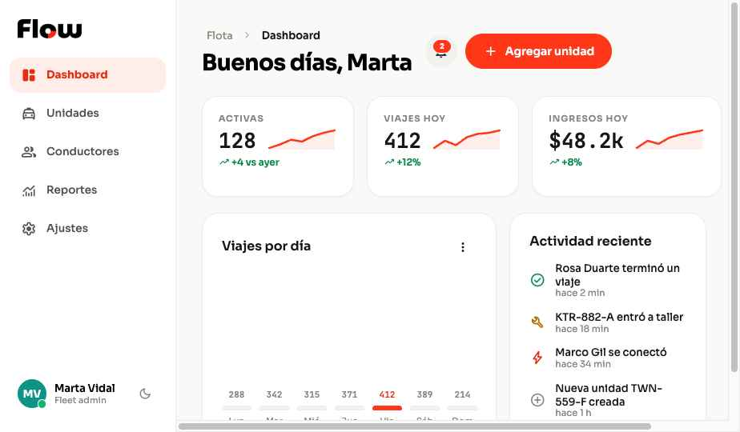
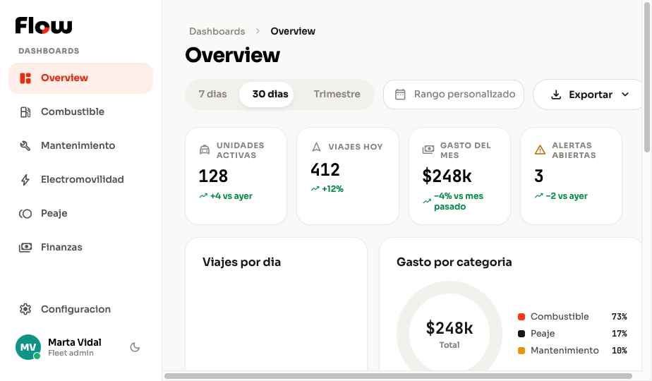
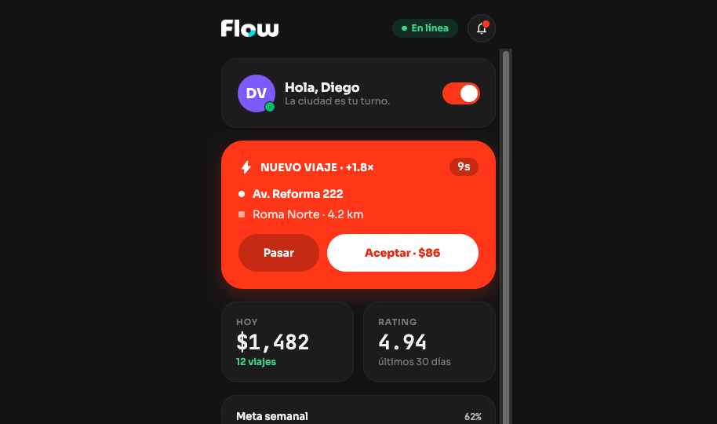
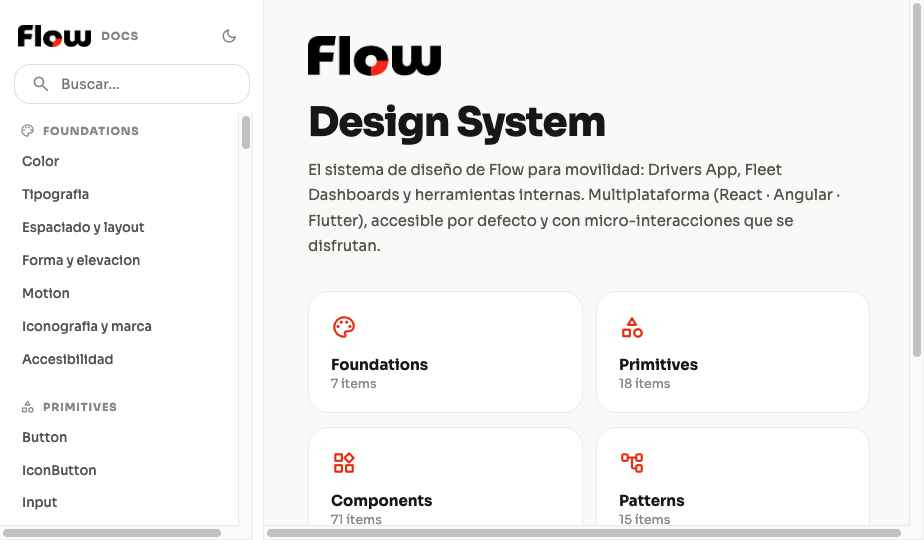

# Flow Design System — Handoff a Claude Code

Este documento es el **punto de entrada para un desarrollador que va a implementar Flow en un codebase real** usando Claude Code. Léelo primero; luego `SKILL.md` y `readme.md` tienen el detalle completo.

---

## Qué es este bundle (léelo antes de copiar nada)

Los archivos de este proyecto son la **referencia canónica de un design system** creada en HTML/CSS/React-ligero. Hay dos capas y se tratan distinto:

1. **Tokens y contratos = fuente de verdad, se adoptan tal cual.**
   - `tokens/*.css` + `styles.css` (custom properties semánticas; el oscuro en `tokens/dark.css`)
   - `platforms/flow.tokens.json` (W3C Design Tokens) y sus builds Angular/Flutter
   - `components/**/<Nombre>.d.ts` (contrato de props, mapea 1:1 a `@Input()` Angular / props Flutter)

2. **Componentes, guidelines, ui_kits, docs y demos = referencia de diseño, NO código de producción a pegar.**
   Son prototipos que muestran el look & behavior deseado. La tarea NO es shippear estos `.jsx`/`.html`, sino **recrearlos en el entorno del codebase destino** (React + tu librería, Angular, Flutter, SwiftUI, etc.) siguiendo sus patrones establecidos. Si aún no hay entorno, elige el framework adecuado e implementa contra los tokens y los `.d.ts`.

## Fidelidad

**Alta fidelidad (hi-fi).** Colores, tipografía, espaciado, forma, elevación y motion son finales y están tokenizados. Recrea la UI de forma pixel-perfect consumiendo los tokens semánticos — nunca hex ni valores mágicos: `var(--text-primary)`, `var(--surface-card)`, `var(--radius-lg)`, `var(--ease-spring)`… Así el modo oscuro sale gratis vía `data-mode`.

---

## Cómo se ve (referencia visual)

Objetivo de fidelidad — recrea esto pixel-perfect consumiendo tokens. Las capturas viven en `docs/handoff-shots/`.

**Fleet Manager dashboard (tema Canvas)** — `ui_kits/fleet-dashboard/`


**Dashboards / Overview (Canvas)** — `ui_kits/dashboards/overview.html`


**Drivers App móvil (modo oscuro)** — `ui_kits/drivers-app/`



**Sitio de documentación navegable** — `docs/index.html` (punto de entrada para explorar todo)


---

## Punto de partida: repo vacío

Este proyecto es la referencia canónica y **el único origen**. Si el repo destino ya tiene código de un intento anterior, no se reconcilia: se parte de cero desde aquí. Lo que existe allá no es entrada de este proceso.

Antes de escribir el primer componente, deja el suelo puesto:

1. **Elige la forma del repo.** React web es la primera plataforma. Monorepo por capa si vas a publicar paquetes; un solo paquete con carpetas por capa si es una app. Lo segundo es más barato y no cierra la puerta a lo primero.
2. **Fija las rutas de las capas.** `architecture.json > targetPaths` ya propone `src/ui/primitives`, `src/ui/components`, `src/ui/patterns`, `src/screens`. Ajústalas una vez; `check-layers.mjs --target` las usa para verificar R1 sobre tu grafo real de imports.
3. **Copia `platforms/CLAUDE.target.md` como `CLAUDE.md`** en la raíz. Si ya hay uno, anexa — no lo sobrescribas.
4. **Adopta los tokens.** Web: `styles.css` importa todo `tokens/`. Angular/Flutter: `node platforms/build-tokens.mjs` (Node 18+, sin dependencias) regenera SCSS y Dart desde `platforms/flow.tokens.json`, que es el master. Edita ahí y regenera; nunca los builds a mano.
5. **Mete la revisión en CI** desde el primer PR, no cuando ya haya cincuenta archivos: `node platforms/check-layers.mjs --target src --json`.

## Orden de construcción

La cascada no es solo una regla de imports: es el orden en que se construye. Nada se puede implementar antes que aquello de lo que depende.

1. **foundations** (7 ítems) — tokens. Sin JSX. Es lo único que puede tener valores absolutos.
2. **shells** (6: `control-shell`, `popover`, `listbox`, `toggle-control`, `overlay-shell`, `data-grid`) — antes que cualquier control. Son los seis que concentran borde, foco, backdrop y keyframes; si un control se escribe antes que su carcasa, la redibuja, y eso es lo que R3 persigue después a un coste mucho mayor.
3. **primitives** (31) y luego **components** (62) — cada control compone su shell.
4. **patterns** (25) y **templates** (16) — al final. Los templates se copian, no se importan.

De los 141 ítems, 37 están en estado `planned` (registrados 2026-09-03): tienen contrato y entrada en el registry, pero aún no tienen build de referencia aquí. En `docs/` llevan el badge Planned.

**Antes de la anchura, una rebanada vertical.** Elige una pantalla y llévala de tokens a pantalla montada. Prueba el sistema de punta a punta y descubre lo que falta cuando cuesta poco cambiarlo. `fleet-dashboard-t` es la mejor candidata: es la única plantilla con contrato escrito.

## Los contratos están completos

**Los 141 ítems tienen contrato**, más los 6 shells y `_base`: 148 archivos en `contracts/` (149 con `_schema`). Las cinco capas están cerradas. Al añadir un ítem nuevo, su contrato se escribe *antes* del componente y va en el mismo PR — `check-contracts.mjs` lo bloquea si falta.

No todos los criterios están verificados. Cada uno declara cómo se comprueba: `automated` corre en el gate, `visual` necesita ojo, y `manual` describe un flujo con estado a lo largo de varias pantallas —volver un paso del wizard sin perder lo escrito, que el error de credenciales no revele qué campo falla— que no se puede medir en un instante. La mayoría de los criterios de `patterns` y `templates` son `manual` y siguen sin verificar: están escritos como especificación, no como hecho comprobado.

Tres deudas conocidas y declaradas en `architecture.json > pendingWork`, para que no las redescubras como bugs:

- **R3 está en cero y bloquea.** Ningún archivo fuera de `shells/` declara borde, foco o radio de control, backdrop fijo ni `@keyframes` propios: los 13 keyframes del sistema viven en `tokens/motion.css`. Si tu implementación reintroduce una carcasa propia, el gate la rechaza.
- R3 es un ratchet mientras existan; cuando lleguen a cero pasa a bloquear.
- **`KanbanBoard`** tiene un solo consumidor y le falta el hueco simétrico a `renderCard` — `renderColumnHeader` y estilo de columna. Decídelo antes de escribirlo.

## Arquitectura de capas — el paso obligatorio

Flow es una cascada: **foundations → primitives → components → patterns → templates**, y las dependencias solo van hacia abajo. El contrato completo esta en `architecture.json` (legible por maquina) y explicado en `Arquitectura de capas.dc.html`.

**Antes de abrir un PR corre las cinco revisiones.** Ninguna necesita dependencias; todas aceptan `--json` para CI:

```bash
node platforms/check-layers.mjs --target src   # R1-R5: direccion de dependencias y variantes
node platforms/check-contracts.mjs             # todo item tiene contrato y valida contra el esquema
node platforms/check-foundations.mjs           # contraste, escala, radios, duraciones, modo oscuro
node platforms/check-color.mjs                 # ningun color literal fuera de tokens/
node platforms/check-targets.mjs               # ningun objetivo tactil por debajo de 44px
```

Los cinco existen porque el mismo defecto aparecio mas de una vez. `check-color` encontro **81 literales** donde a ojo parecian tres; `check-targets` encontro **veintinueve objetivos** por debajo de 44px en veintiseis archivos. Un defecto que se repite vale mas como chequeo que como arreglo.

Cuatro reglas, y las tres primeras se pueden reventar:

- **R1 — las dependencias solo van hacia abajo.** Ningun archivo importa de una capa superior; de su propia capa, solo shells. Una dependencia externa (ECharts, tiles de mapa) no cuenta: R1 mira el grafo del sistema. **Bloquea.**
- **R2 — una variante no es un item.** Un item, un archivo. Nada declarado en `supersedes` puede sobrevivir: ni archivo, ni entrada de registry, **ni mencion en un texto que lo recomiende**. Esa ultima es la que se cuela: no es una ruta rota, es una frase que dice «usa X» sobre algo que ya no existe. **Bloquea.**
- **R3 — una carcasa, un dueno.** Fuera de `shells/`, nadie declara borde+foco+radio de control, backdrop fijo ni `@keyframes` propios. Llego a cero y **bloquea**.
- **R4 — la composicion no se filtra a la API.** Ninguna prop publica repite un nombre de `composition`. Es lo que se violo para llegar a `SelectCountry`: una decision interna se volvio nombre publico. **Bloquea.**

### Los contratos son el entregable, no el codigo

Los `.jsx` de este repo son referencia y son desechables. Lo que se adopta son los contratos de `contracts/`, con tres bloques de distinta obligatoriedad:

- `api` — **normativo y versionado.** Las props publicas. Unica fuente del `.d.ts`. Romperlo es breaking change.
- `conformance` — **normativo y agnostico de framework.** Comportamiento observable: Escape cierra, el foco vuelve, 44px de target. Se verifica desde fuera, sin saber como esta construido adentro. `contracts/_base.json` son los criterios que hereda todo item.
- `composition` — **normativo aqui, informativo alla.** Como lo construimos. Si tu codebase ya tiene su propio popover, usalo — pero heredas la obligacion de cumplir por tu cuenta los criterios de `conformance` que ese shell garantizaba.

Cada criterio trae `verify: automated | visual | manual` y `level: must | should`. La revision automatizada corre solo los `automated`, y **sobre el DOM montado, no sobre el codigo**: en esta sesion tres shells cumplian su contrato leyendo el archivo y lo incumplian medidos en la pagina.

### El gate se acota por adopcion

`architecture.json > adoption.adopted` arranca vacio. Un item entra a la reja cuando alguien lo implementa, asi que la revision no puede tronar el dia uno por razones legitimas. Agrega el id cuando lo adoptes; no antes.

### La regla tambien va en tu `CLAUDE.md`

Copia `platforms/CLAUDE.target.md` al `CLAUDE.md` de tu repo. La revision atrapa la violacion despues de escribirla; el `CLAUDE.md` evita que se escriba, porque Claude Code lo lee en cada sesion. Los dos hacen falta: uno previene, el otro atrapa lo que se colo en una sesion larga.

---

## Reglas duras (no negociables)

- **Tokens semánticos siempre**, nunca hex directos. Rompe esto y se rompe el modo oscuro.
- **Rojo marca `#FF3617` es quirúrgico**: máx 1 CTA `accent` por vista, estado vivo, foco, links. Danger es `#D92D20` (distinto). Nunca decorativo.
- **Motion**: `--ease-spring` para lo que se toca; `--ease-out` para lo que aparece; 100–400ms; respeta `prefers-reduced-motion`.
- **A11y**: foco visible (`--focus-ring`) siempre; hit targets ≥44px; texto ≥4.5:1; `ariaLabel` obligatorio en IconButton.
- **Datos en JetBrains Mono**: placas, IDs, KPIs, montos. Todo lo demás en Sora.
- **Iconos**: Material Symbols Rounded únicamente. Nada de emoji ni SVG a mano.
- **Superficies planas**: sin gradientes; jerarquía por superficie + sombra suave.
- **Copy**: español neutro, tuteo, sentence case. API/props en inglés.

---

## Mapa del proyecto

| Carpeta | Qué es | Cómo tratarlo |
|---|---|---|
| `styles.css`, `tokens/` | Tokens CSS (color, type, spacing, shape, elevation, motion, fonts, modo oscuro) | **Adoptar tal cual** |
| `platforms/` | `flow.tokens.json` (W3C, master) + builds Angular/Flutter + `build-tokens.mjs` | **Adoptar / regenerar** |
| `components/` | Primitives React de referencia + `.d.ts` (contrato) + `.prompt.md` (uso) | Contratos: adoptar. `.jsx`: recrear |
| `guidelines/` | Specimen cards de foundations | Referencia visual |
| `ui_kits/` | Templates/patterns (fleet-dashboard, dashboards, internal-tools, drivers-app, wallet, rutas, auth, onboarding, settings, wizard, mailings…) | Referencia de layout/flujo |
| `docs/` | Sitio de documentación navegable + registries | Referencia; `docs/index.html` para explorar |
| `assets/` | Logo (`flow-logo.png`) | Único asset de marca real |
| `_ds_bundle.js` | Bundle generado (`window.Flow`) que consumen demos | No es código fuente; regenerable |

## Inventario

Tres productos (Drivers App móvil, Fleet Manager dashboard, Internal Tools CRM), un solo tema (`Canvas`) con modo oscuro por `data-mode="dark"` — **ningún componente cambia de estructura entre temas, solo tokens**. Inventario completo de componentes en `SKILL.md`.

## Notas de implementación

- **PaymentCard**: define `window.FLOW_ASSET_BASE` con la ruta a la raíz del DS para que cargue el logo.
- **Marco móvil**: los kits móviles usan `ui_kits/ios-frame.jsx` solo para el demo; no es parte del DS a portar.
- **Mailings** (`ui_kits/mailings/`): HTML de tablas para email, con sus propias restricciones (ver su README) — no comparten el runtime de componentes.
- Un dev que no estuvo en esta conversación debería poder implementar Flow con este documento + `readme.md` + `SKILL.md` + los `.d.ts`. Si algo falta, empieza por `docs/index.html`.
